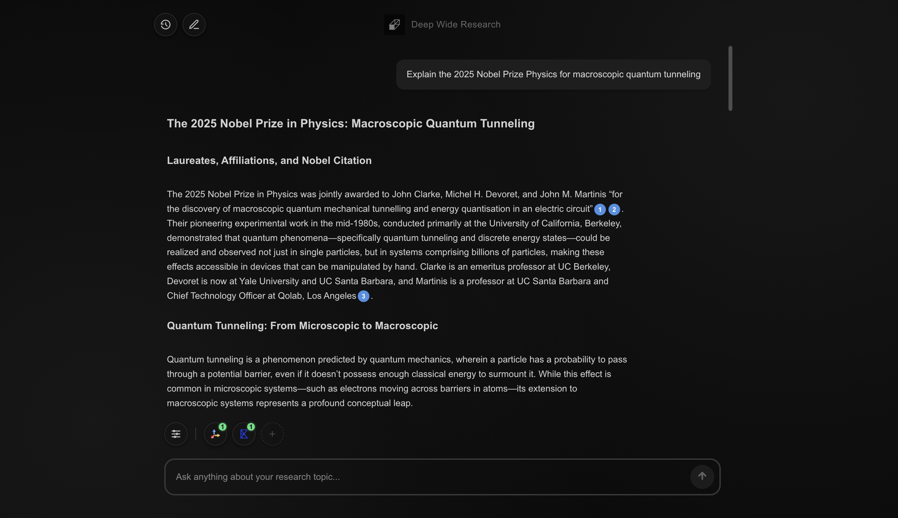

<p align="center">
  
</p>

<h1 align="center">Open Deep Wide Research</h1>

<p align="center">
  <a href="https://www.puppyagent.com" target="_blank">
    
  </a>
  &nbsp;
  <a href="https://x.com/PuppyAgentTech" target="_blank">
    
  </a>
  &nbsp;
  <a href="https://discord.gg/puppychat" target="_blank">
    
  </a>
  &nbsp;
  <a href="mailto:support@puppyagent.com">
    
  </a>
</p>

<p align="center">
  <strong>One API, all RAG scenarios</strong>
</p>

<p align="center">
  
</p>

## Why Do You Need Open Deep Wide Research?

In 2025, we observed three critical trends reshaping the Retrieval-Augmented Generation (RAG) tech stacks:

1.  Traditional, Rigid, pipeline-driven RAG is giving way to more dynamic agentic RAG systems.

2.  The emergence of MCP is dramatically lowering the complexity of developing enterprise-grade Agentic RAG.

3.  Developers desperately need to customize and balance response time, the breadth of information retrieval, and cost. However, most agent solution ignore this critical requirement.

Based on these trends, the market needs a single, open-source RAG agent that is MCP-compatible and offers granular control over performance, scope, and cost.

We built **Open Deep Wide Research** to be that solution, providing one agent for all RAG scenarios. Its core is the "Deep/Wide" coordinate system, which gives you the control you need:

- **Deep:** Controls response time and reasoning depth.
- **Wide:** Controls information breadth from various sources.
- **Deep × Wide:** Predicts the cost of a single agentic RAG response.

> If this mission resonates with you, please give us a star ⭐ and fork it! 🤞

---

## Features

- **Deep × Wide Control** – Tune the depth of reasoning and breadth of information sources to perfectly match any RAG scenario, from quick chats to in-depth analysis.
- **Predictable Cost Management** – No more surprise bills. Cost is a transparent function of your Deep × Wide settings, giving you full control over your budget.
- **MCP Protocol Native Support** – Built on the Model Context Protocol for seamless integration with any compliant data source or tool, creating a truly extensible and future-proof agent.
- **Self-Hosted for Maximum Privacy** – Deploy on your own infrastructure to maintain absolute control over your data and meet the strictest security requirements.
- **Hot‑Swappable Models** – Plug in OpenAI, Claude, or your private LLM instantly.
- **Customizable Search Engines** – Integrate any search provider. Tavily and Exa supported out-of-the-box. As long as it supports MCP.


---

## Get Started

### Prerequisites
- Python 3.9+ and Node.js 18+
- API keys: Open Router (required), and  Exa / Tavily (at least one)
- Recommended model: open-o4mini

### Deployment Options
- API-only (Backend): If you only need the Deep Research backend as an API to embed in your codebase, deploy the backend only.
- Full stack (Frontend + Backend): If you want the full experience with the web UI, deploy both the backend and the frontend.

### Backend

1. Copy the env template:

```bash
cp deep_wide_research/env.example deep_wide_research/.env
```

2. Edit the copied .env and set your keys:

```bash
# deep_wide_research/.env
OPENROUTER_API_KEY=your_key
# At least one of the following
EXA_API_KEY=your_exa_key
# or
TAVILY_API_KEY=your_tavily_key
```

3. Set up and run the API server:

```bash
cd deep_wide_research
python -m venv venv && source venv/bin/activate
pip install -r requirements.txt

uvicorn main:app --reload --port 8000
```

### Frontend

Create `chat_interface/.env.local` (you can copy from the template):

```bash
cp chat_interface/env.example chat_interface/.env.local
```

```bash
cd chat_interface
npm install && npm run dev
```

Open **http://localhost:3000** – Start researching in seconds.

### Docker (Production)

```bash
docker-compose up -d
```

---

## Documentation

- [Integration Guide](INTEGRATION_GUIDE.md) – Connect your own LLM providers
- [Railway Deploy](RAILWAY_DEPLOY.md) – One-click cloud deployment
- [Deep/Wide Grid Design](DEEP_WIDE_GRID_DESIGN.md) – Architecture deep dive

---

## License

Apache 2.0 – See [LICENSE](LICENSE) file.
